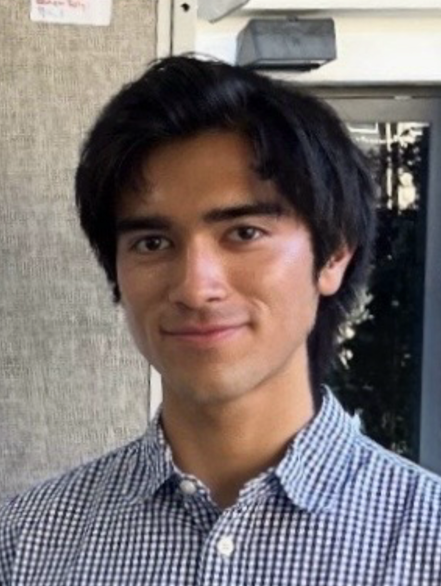

::: {.text-center}
{width=500}

# Broderick Bownds

Broderick Bownds is a junior engineering major at Harvey Mudd College studying electrical and computer engineering. He designs system-level hardware across embedded systems, power electronics, and sensor-driven architectures, with experience carrying projects from modeling and CAD through prototyping and validation. He is committed to equitable and sustainable engineering, having redesigned neuroimaging hardware to better serve people with textured hair, mentored students in engineering fundamentals and digital design, and contributed to inclusive STEM communities through NSBE and the Annenberg Leadership Forum, where he engages with the United Nations Sustainable Development Goals.

[<i class="bi bi-linkedin"></i> LinkedIn](https://www.linkedin.com/in/broderickbownds/)   [<i class="bi bi-globe"></i> Website](https://brbownds.github.io/e155-portfolio/)

<!-- Spacer -->

::: {.text-center}
{width=500}

# Sebastian Heredia

Sebastian Heredia is a junior engineering major at Harvey Mudd College with a strong foundation in math and a growing focus on electrical engineering, embedded systems, and robotics. He’s passionate about building hardware and systems that sense, respond, and interact with the world, thriving in fast-paced, hands-on environments where he can design, prototype, and iterate quickly. Outside of engineering, Sebastian explores visual and audio storytelling through photography, sketching, and editing—creative practices that sharpen the precision, structure, and attention to detail he brings to technical work. Whether developing embedded systems or building digital tools, he approaches engineering with both methodical rigor and creative problem-solving.

[<i class="bi bi-linkedin"></i> LinkedIn](https://www.linkedin.com/in/sebastian-heredia4/)   [<i class="bi bi-globe"></i> Website](https://dylansebastianheredia.github.io/)

