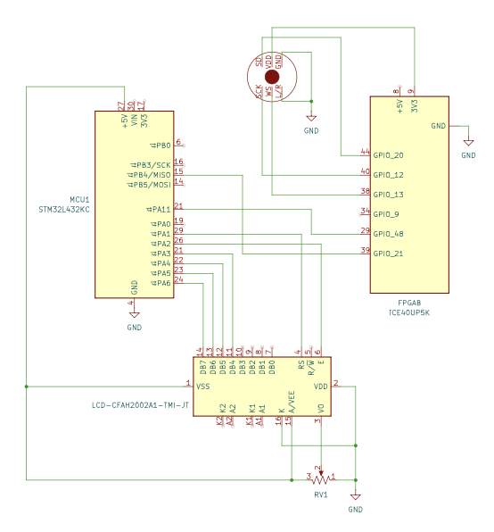

## Schematic:
{width=500}

The source code for the project can be found in the associated [GitHub repository.](https://github.com/DylanSebastianHeredia/E155_Tuner_Project )

## Results:

The two riskiest elements and bottle necks for time for this project were implementing the FFT design on the FPGA and accurately reading input data from the I2S MEMs microphone. The FFT algorithm was successfully implemented in simulation, however, complications with the microphone prevented the project from advancing beyond simulation and into hardware. 

Designing the FFT modules in SystemVerilog took 3-weeks to initially write up and an additional week to verify. For the team’s final check-off, the 512-point 16-bit fixed-point FFT on the FPGA was fully verified in simulation at the fft.sv module level. Figure 6 below shows how the outputs between python simulation and the team’s FFT match closely for the same discretized, ideal input cosine wave. Notably, in order to meet the LUT and I/O port requirements in Lattice Radiant for the iCE40 UP5K FPGA, an fft_master.sv module was created to house the bit and left-right select clock divider sub-modules.  ADD QUANTITATIVE RESULTS (Compare the `test_out.memh` file from hardware to software)

{width=800}

Since the MCU cannot be simulated with made-up data in Segger and the data pipeline for the project was stunted at the beginning by the microphone, the dominant frequency detection module, note LUT, and pitch deviation modules on the MCU were unable to be tested continuously. Therefore, the performance metric of update rate on the LCD was not able to be verified. Nevertheless, it was shown that the MCU was able to display from the note LUT as shown in figure 7 below. 

Had the I2S microphone been able to work as expected, it is promising that the MCU functionalities would have been able to be verified since the SPI code form E155 Lab 7 Tutorial Repository was used to interface the FPGA and MCU. 

(Image of LCD displaying A4, 440Hz, +0 cents)
Figure 7: The LCD screen can accurately display note name, pitch, and offset from the MCU LUT. 

Results sections clearly and quantitatively outlines the key performance aspects of the design with commentary to explain the design decisions.

## Bill of Materials:
| Part Name (Link + Website)                | Datasheet (Link)                            | Quantity | Total Cost (Tax + Shipping)                      | Arrival Date     |
|-------------------------------------------|---------------------------------------------|----------|--------------------------------------------------|------------------|
| INMP441 I2S MEMS                          | [INMP441](https://www.digikey.com/htmldatasheets/production/1431884/0/0/1/INMP441-Datasheet.pdf) | 5        | [$10.94](https://www.aliexpress.com/p/shoppingcart/index.html?spm=a2g0o.tesla.header.1.472d6fMJ6fMJtP) (AliExpress) | November 5–15    |
| 2×16 I2C 1602 LCD Screen (PCF8574)        | [LCD1602 (PCF8574)](https://www.crystalfontz.com/product/cfah2002a1tmijt-20x2-character-display-module) | 1        | Stockroom (Crystal Fontz) | -       |
| **Total Cost**                            |                                             |          | **$15.94**       |                  |

# References:

[1] Vercruysse, Alec, et al. “A Tutorial-style Single-cycle Fast Fourier Transform Processor.” Proceedings of the Great Lakes Symposium on VLSI (GLSVLSI 2022), ACM, 2022, pp. 525–530. 

[2] G. William Slade. 2013. The Fast Fourier Transform in Hardware: A Tutorial Based on an FPGA Implementation. (2013), 26 pages. Retrieved April 8, 2022 from https://www.researchgate.net/publication/235995761_The_Fast_Fourier_ Transform_in_Hardware_A_Tutorial_Based_on_an_FPGA_Implementation

# Acknowledgements:

Thank you to Prof. Spencer for sharing helpful resources and literature in starting the project. Thank you to Leilani E. for sharing her snacks in the ECF. 

