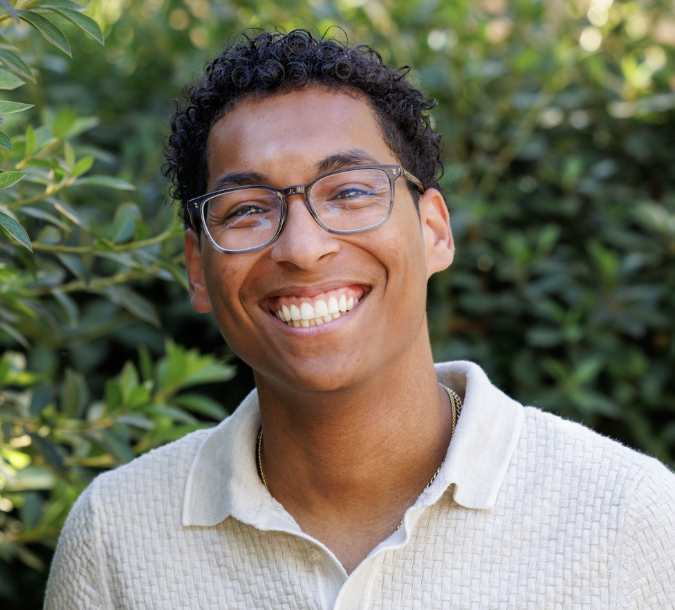

::: {.grid .gap-4}

::: {.g-col-6}
{.img-fluid .rounded}

# Broderick Bownds

Broderick Bownds is a junior engineering major at Harvey Mudd College specializing in electrical and computer engineering. He works at the intersection of hardware systems, embedded signal processing, and power electronics. His technical range spans embedded systems, digital electronics, power conversion, sensor integration, CAD-based mechanical prototyping, and computational imaging. Broderick is also committed to equitable innovation. He has redesigned neuroimaging hardware to better serve people with textured hair, mentors students in engineering fundamentals and digital design, and contributes to inclusive STEM communities through NSBE and the Annenberg Leadership Forum.

Website / LinkedIn Link:

:::

::: {.g-col-6}
{.img-fluid .rounded}

# Sebastian Heredia

Sebastian Heredia is a junior engineering major at Harvey Mudd College with a strong foundation in math and a growing focus on electrical engineering, embedded systems, and robotics. He’s passionate about building hardware and systems that sense, respond, and interact with the world, thriving in fast-paced, hands-on environments where he can design, prototype, and iterate quickly. Outside of engineering, Sebastian explores visual and audio storytelling through photography, sketching, and editing—creative practices that sharpen the precision, structure, and attention to detail he brings to technical work. Whether developing embedded systems or building digital tools, he approaches engineering with both methodical rigor and creative problem-solving.

Website / LinkedIn Link:

:::

:::

